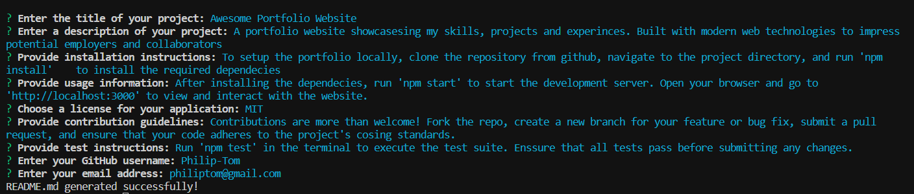
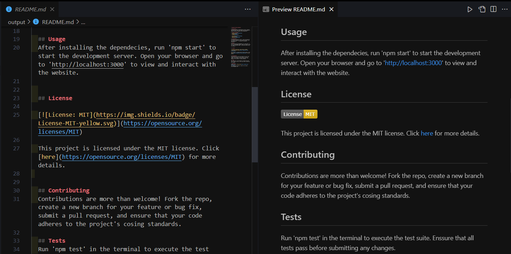

# Professional README Generator

## Description

Creating a high-quality README is essential for any open-source project on GitHub. The Professional README Generator simplifies this process by providing a command-line application that uses the Inquirer package to dynamically generate a professional README.md file based on user input.

## Table of Contents

- [Installation](#installation)
- [Usage](#usage)
- [Walkthrough Video](#walkthrough-video)
- [Screenshots](#screenshots)
- [Questions](#questions)
- [Acknowledgments](#acknowledgments)

## Installation

To set up the project, follow these steps:

1. Clone the repository:

    ```bash
    git clone https://github.com/Philip-Tom/9-NodeJS.git
    ```

2. Navigate to the project directory:

    ```bash
    cd 9-NodeJS
    ```

3. Install the required dependencies:

    ```bash
    npm install
    ```

## Usage

Generate a professional README by running the following command:

```bash
node index.js
```

Follow the prompts to input information about your project.

## Screenshots

### SnapShot of terminal input


### SnapShot of generated README Output


## Walkthrough Video
<video src="assets/demo.mp4" controls title="Demo Video"></video>


## Questions
If you have any questions or need further assistance, feel free to contact me:

 - [Github](https://github.com/Philip-Tom)

